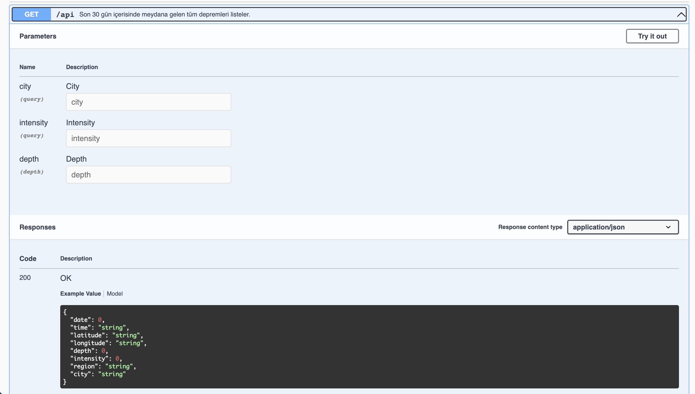
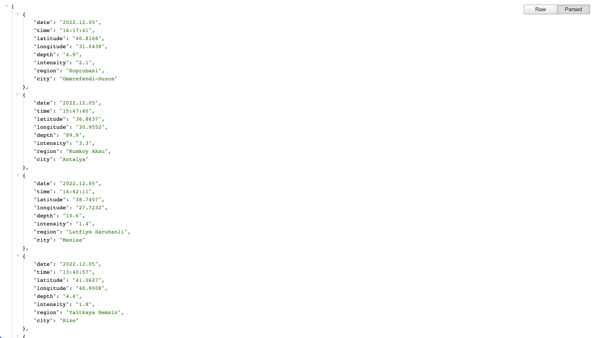

# Türkiye Deprem API

Türkiye'de en son meydana gelen 500 depremi listeler.

## Kurulum

Node.js kurulu değilseniz güncel versiyonunu kurulumunu gerçekleştirin, istediğiniz portta çalıştırmak için .env dosyasını değiştirin.
(Varsayılan 3333) sonrasında ise

```bash
npm i && npm start
```

komutunu uygulayarak projeyi ayağa kaldırın.

#### Swagger



#### Api Örneği



## Kullanımı

### http://localhost:3333/api

adresinge giderseniz apilerinizi veya

### http://localhost:3333/swagger

adresine giderseniz swagger dökümantasyonunu bulabilirsiniz.

Not: Projede maddi hiçbir amaç güdülmemektedir.

İletişime geçmek için: [linkedIn](https://linkedin.com/in/husnu)
